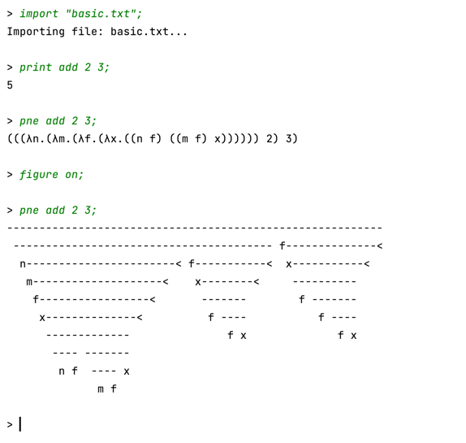

# Alligators' Lambda Simulator

## Introduction

This project is made during my visit at UT Austin, 
where it is selected as the final project for the 
Java programming course. 

This program can simulate beta and eta reduction, 
and can generate alligator figures introduced in
https://worrydream.com/AlligatorEggs/
. 

## Running 

A `antlr-*-complete.jar` should be placed to `lib`, 
use `IntelliJ IDEA` to run the `Main` configuration. 

Due to the time I did not fully automate the build 
and test scripts. 

## Screenshots

## Limitations / TODO List

- Did not handle recursive functions
- May crash during large evaluations